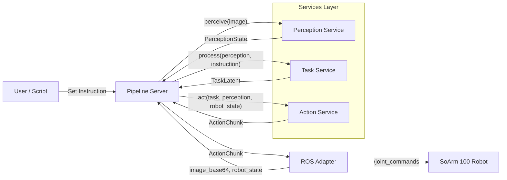
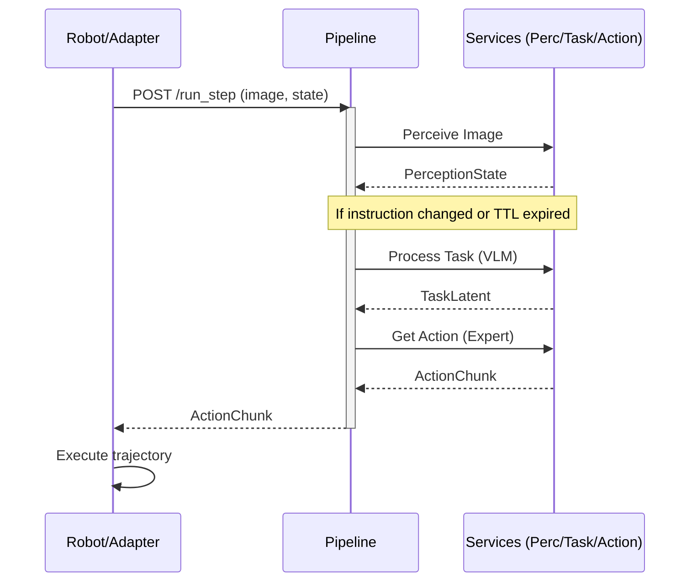

# Hive Mind - Architecture Overview

This document provides a technical overview of the **Hive Mind** project, a modular robot AI stack designed for Vision-Language-Action (VLA) models.

## System Architecture

The system is built on a microservice architecture, allowing for modular development, testing, and deployment. The core logic is orchestrated by a **Pipeline** service that interfaces with specialized services for perception, task planning, and action prediction.

## Key Components

### 1. Pipeline Orchestrator (`services/pipeline/`)
The central coordinator that manages the control loop. It implements:
- **Frequency Control**: Runs the "heavy" VLM (Task Service) at a lower frequency (e.g., 1Hz) while running the Action Expert at a higher frequency (e.g., 20Hz).
- **Inference Orchestration**: Sequences calls to Perception, Task, and Action services.
- **State Management**: Maintains the current instruction and caches the latest task latent for multi-step execution.
- **Logging**: Captures synchronized robot state, images, and model outputs for future training.

### 2. Perception Service (`services/perception/`)
Converts raw sensor data into structured representations.
- **Input**: Base64 encoded images, camera poses.
- **Output**: `PerceptionState` containing scene tokens and processed perception data.

### 3. Task Service (`services/task/`)
The "brain" of the system, typically powered by a VLM (e.g., PaliGemma, OpenVLA).
- **Input**: `PerceptionState` and high-level instruction (e.g., "Pick up the apple").
- **Output**: `TaskLatent` containing goal embeddings and semantic constraints.

### 4. Action Expert (`services/action/`)
The "hands" of the system, implementing policies like ACT or Diffusion.
- **Input**: `TaskLatent`, `PerceptionState`, and current `RobotState`.
- **Output**: `ActionChunk` containing a temporal sequence of joint positions or velocities.
- **Modes**: Supports both `learned` (ML-based) and `scripted` (for validation) modes.

### 5. ROS Adapter (`hardware/ros_adapter/`)
The bridge between the AI stack and the physical robot (specifically tested with SoArm 100).
- Subscribes to ROS topics for images and joint states.
- interfaces with the Pipeline Server via HTTP.
- Publishes commands back to the hardware controllers.

## Data Flow (Execution Step)

## Configuration & Modularity

The system utilizes a **Registry and Factory** pattern to allow for easy swapping of model backends without changing the core orchestration logic.

### Registry Pattern
Each service layer (Perception, Task, Action) has a registry that maps string identifiers to implementation classes. 
- `common/registry/`: Contains the global registry of available models and executors.
- `services/*/factory.py`: Uses these registries to instantiate the correct model based on the configuration.

### Master Configuration
The entire stack is configured via a central YAML file (usually `configs/master_config.yaml`). This allows toggling between different VLMs (e.g., `paligemma` vs `openvla`) or action experts (`act` vs `diffusion`) with a single change.

## Safety & Health

## Performance Targets

| Metric | Target | Role |
|--------|--------|------|
| VLM Latency | ~100-500ms | Strategic planning |
| Action Latency | <20ms | Reactive control |
| Control Loop | 20Hz | Smooth motion |
